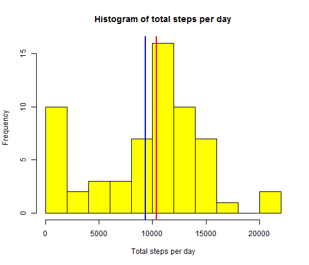
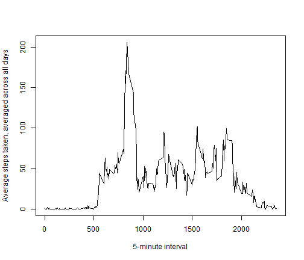
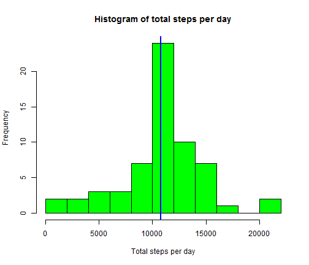
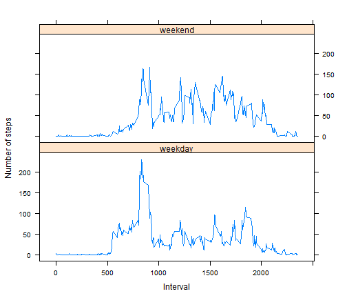

# Reproducible Research: Peer Assessment 1

Global settings


```r
opts_chunk$set(echo = TRUE, results = "show", cache = TRUE, fig.height = 6)
suppressWarnings(library(reshape2))
options(scipen = 999)
```


## Loading and preprocessing the data

```r
my <- read.csv("activity.csv", header = T)
my1 <- aggregate(my$steps, by = list(my$date), FUN = sum, na.rm = T)
```


## What is mean total number of steps taken per day?

```r
hist(my1$x, breaks = 10, xlab = "Total steps per day", main = "Histogram of total steps per day", 
    col = "yellow")
med <- median(my1$x)
meen <- mean(my1$x)
abline(v = med, lwd = 2, col = "red")
abline(v = meen, lwd = 2, col = "blue")
```

 


Mean total steps per day is 9354.2295 and the median total steps per day is 10395

## What is the average daily activity pattern?
This plot will show the average daily activity pattern. To plot this, we first melt the data and then cast it by interval and compute the mean on the steps.


```r
molten <- melt(my, id = c("date", "interval"))
cast1 <- dcast(molten, formula = interval ~ variable, function(x) mean(x, na.rm = T))
with(cast1, plot(interval, steps, type = "l", xlab = "5-minute interval", ylab = "Average steps taken, averaged across all days"))
```

 


```r
maxx <- max(cast1$steps)
maxx1 <- cast1[cast1$steps == maxx, 1]
```


The max number of steps averaged across all days is in interval number ``835``

## Imputing missing values

First we create a new dataframe which is the same as the original dataframe
We then fill in the missing values with the mean of all steps for each interval averaged across all days that we just calcuated and plotted above


```r
newdata <- my
newdata[is.na(newdata)] <- cast1$steps
```


Plotting the histogram again for total steps per day and calculating the mean and median, we see that the mean and median are the same this time around.


```r
new1 <- aggregate(newdata$steps, by = list(newdata$date), FUN = sum, na.rm = T)
hist(new1$x, breaks = 10, xlab = "Total steps per day", main = "Histogram of total steps per day", 
    col = "green")
newmed <- median(new1$x)
newmeen <- mean(new1$x)
abline(v = newmed, lwd = 2, col = "red")
abline(v = newmeen, lwd = 2, col = "blue")
```

 


The new mean is 10766.1887 and the new median is 10766.1887 


## Are there differences in activity patterns between weekdays and weekends?

To find that out, we need to create a new column in our dataset which has two factors - weekday and weekend.
The below piece of code does that.


```r
newdata$date <- as.POSIXlt(newdata$date)
newdata$days <- weekdays(newdata$date)
newdata$day <- NA
newdata[((newdata[, 4] == "Saturday") | (newdata[, 4] == "Sunday")), 5] <- "weekend"
newdata[(!((newdata[, 4] == "Saturday") | (newdata[, 4] == "Sunday"))), 5] <- "weekday"
newdata$day <- as.factor(newdata$day)
```


Explanation of the above piece of code:  
1. Convert the date from factor to POSIXlt class  
2. Add a new column called days which are the names of the weekdays like Monday, Tuesday etc.  
3. Add another column called day and fill it with NAs  
4. The next two lines are complex - First find all rows where the 4th column (days) is either a Saturday or a Sunday  
5. Next, For those rows, insert "weekend" in the 5th column (day)  
6. Do the same thing for "weekday" by calculating NOT saturday or sunday  
7. Once the day column is popluated, convert it to a factor class  


However, to plot this data, there is one final transformation we need to make: We need to melt the data and cast it again such that we only have the two-factor day column, the interval vcolumn and the average steps taken for that interval across a weekday or weekend.The code for this transformation is below.


```r
finaldata <- newdata[, -2]  #removing the POSIXlt date column
finaldata <- finaldata[, -3]  #removing the weekdays column
molten2 <- melt(finaldata, id = c("day", "interval"))
cast2 <- dcast(molten2, formula = interval + day ~ variable, function(x) mean(x, 
    na.rm = T))
```


We then plot the panel plot of number of steps separated by weekdays and weekends


```r
suppressWarnings(library(lattice))
xyplot(steps ~ interval | day, cast2, layout = c(1, 2), xlab = "Interval", ylab = "Number of steps", 
    type = "l")
```

 


